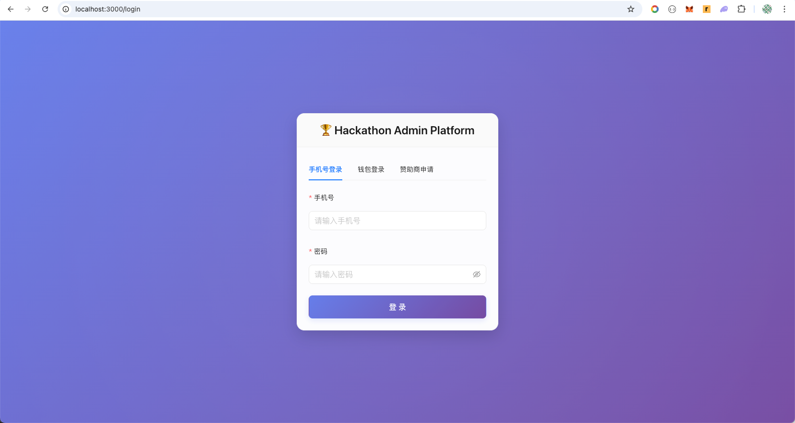
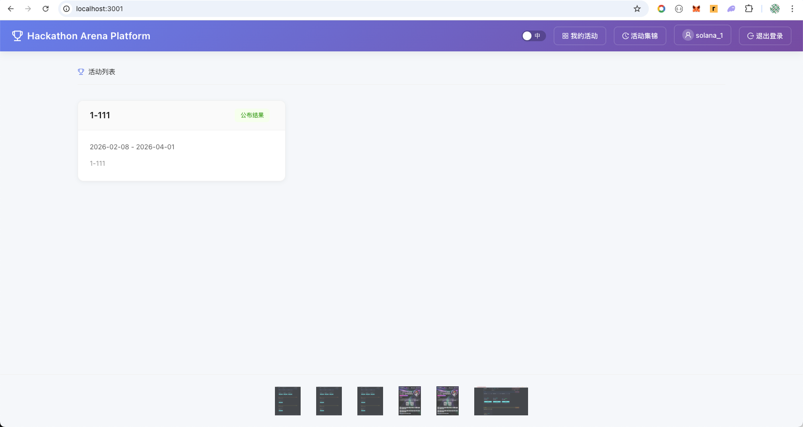
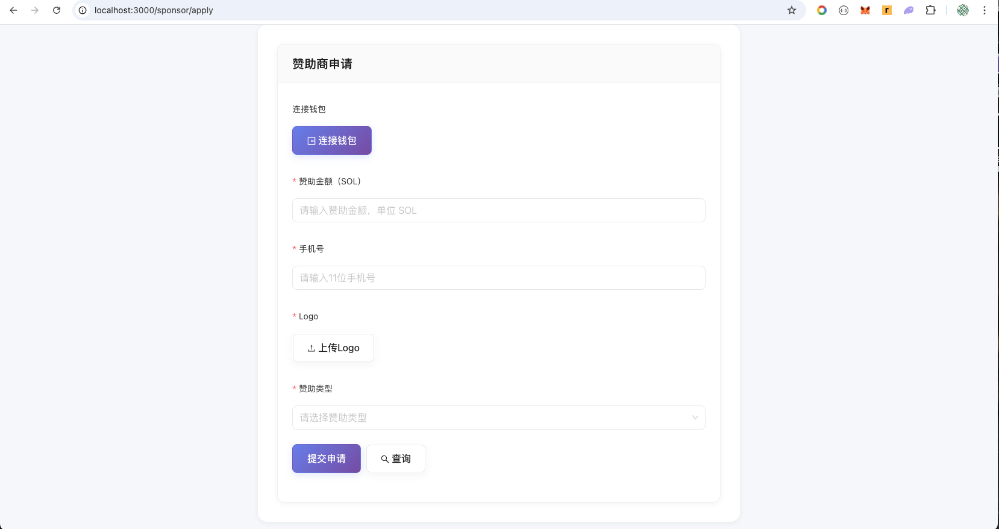
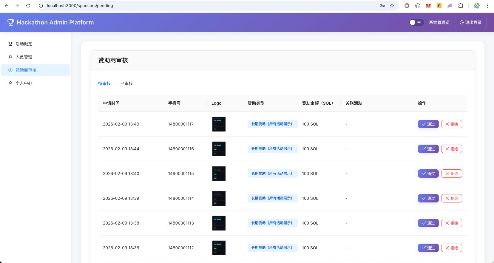
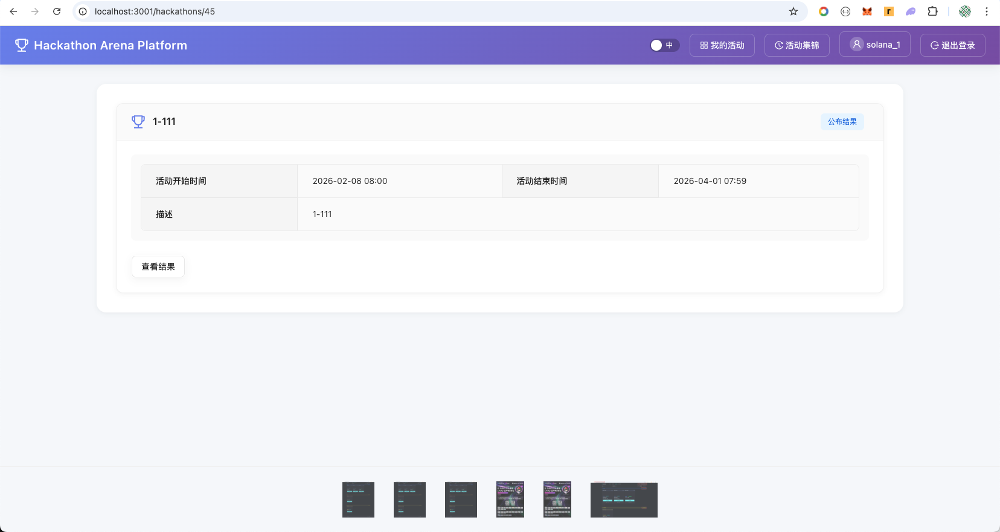
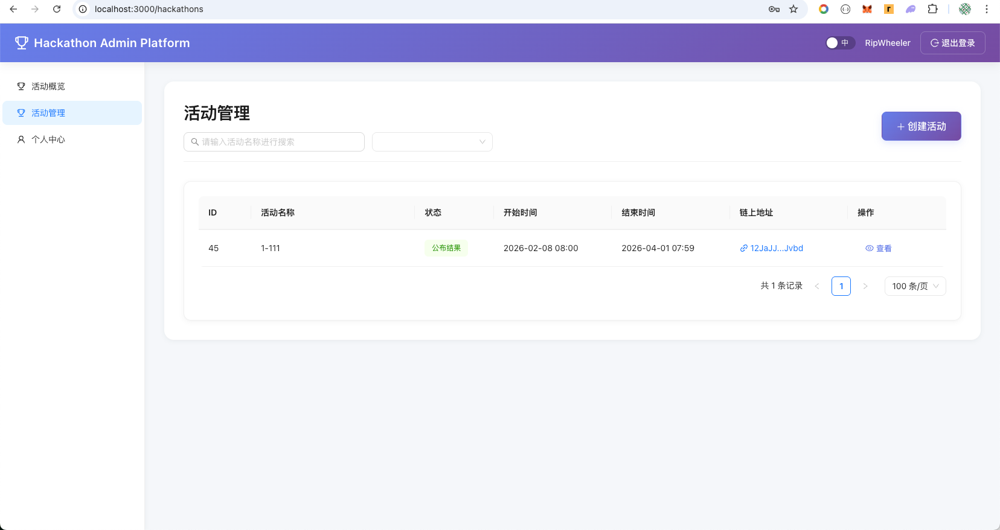
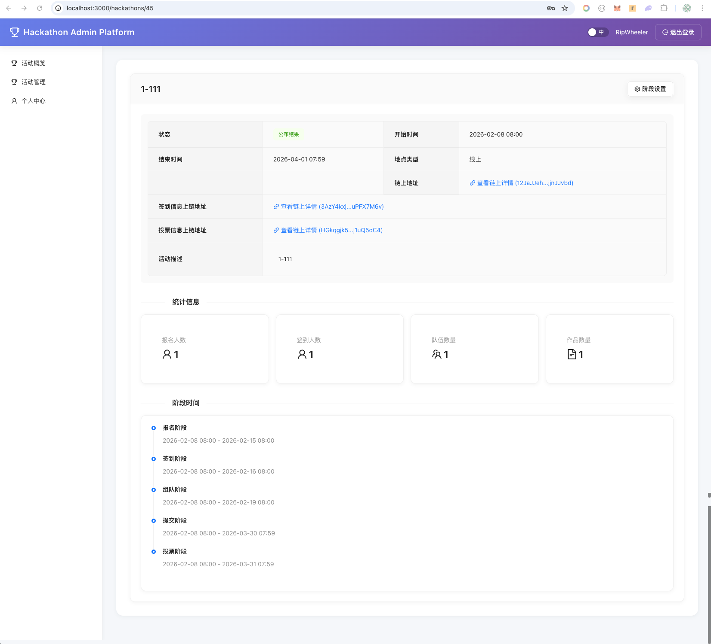

# 项目名称

> Solana 黑客松活动平台（Hackathon Platform Web3）

## 💻 项目 Repo

https://github.com/fossilman/Solana-bootcamp-2026-s1

## 📌 项目简介

这是一个基于 Solana 的全流程黑客松活动平台，包含**管理后台（Admin）**与**选手端（Arena）**双端。主办方在后台创建活动、配置阶段时间，将活动信息与关键数据（发布、签到名单、投票结果）上链存证；赞助商通过链上金库申请赞助，审核通过后资金自动转入主办方钱包、拒绝则原路退回。选手端支持钱包登录、报名、签到、组队、提交作品与链上投票，利用区块链的透明与不可篡改性保障活动流程与资金可信。

## 🛠️ 技术栈

- **智能合约**：Rust + Anchor Framework（活动发布、阶段流转、签到上链、投票/撤销投票、投票汇总、赞助商配置与申请/审核）
- **后端**：Go 1.21 + Gin + GORM + MySQL，JWT 认证，Solana 交互（gagliardetto/solana-go）
- **前端**：
  - 管理后台（admin）：React 18 + TypeScript + Vite + Ant Design + @solana/web3.js，多语言（i18next）
  - 选手端（arena）：React 18 + TypeScript + Vite + Ant Design + axios，钱包登录与链上操作
- **工具**：Solana CLI、@solana/web3.js、Yarn

## 🎬 Demo 演示

### 演示链接

- 🎥 视频演示：
  - 赞助商演示：https://www.bilibili.com/video/BV1GgcuzaEiu/?vd_source=cf3d4b2491c1d762b517c1b383470ea7
  - 流程演示：https://www.bilibili.com/video/BV1XgcuzhENq/?vd_source=cf3d4b2491c1d762b517c1b383470ea7
- 🌐 在线 Demo（如有）：无

### 功能截图

## 💡 核心功能

1. **活动全生命周期管理**：草稿 → 发布上链 → 报名 → 签到 → 组队 → 提交作品 → 投票 → 公布结果；阶段切换可上链（Solana Activity 状态与阶段）。
2. **链上活动与存证**：活动发布（`publish_activity`）、签到名单上链（`upload_check_ins`）、投票与撤销投票（`vote` / `revoke_vote`）、投票汇总上链（`upload_vote_tally`）。
3. **赞助商资金链上托管**：初始化赞助配置与金库（`initialize_sponsor_config`）、赞助申请存入金库（`sponsor_apply`）、审核通过转主办方/拒绝原路退回（`approve_sponsor` / `reject_sponsor`）。
4. **选手端完整流程**：钱包连接与认证、活动列表/归档、报名与取消、签到、创建/加入/离开队伍、提交/编辑作品、对作品投票、查看结果。
5. **管理后台**：管理员/组织者/赞助商角色、用户管理、活动 CRUD、阶段时间配置、活动发布与链上地址回写、海报二维码、赞助申请审核、仪表盘统计。

## ✍️ 项目创作者

1. 创作者昵称：fossilman、
2. 创作者联系方式：https://github.com/fossilman、
3. 创作者 Solana USDC 钱包地址：2PMjGQBiZdDJ8mxY3r2SjiwdCiVDq5Gryqb6dneDq19T、
